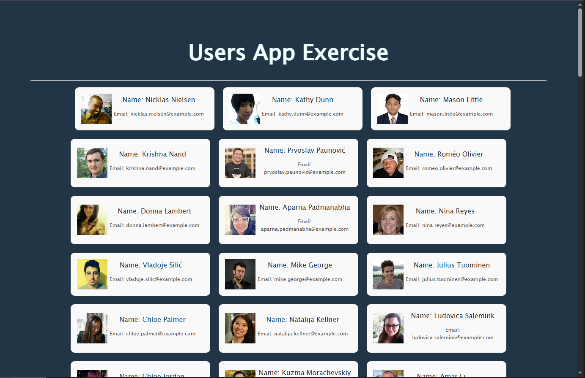
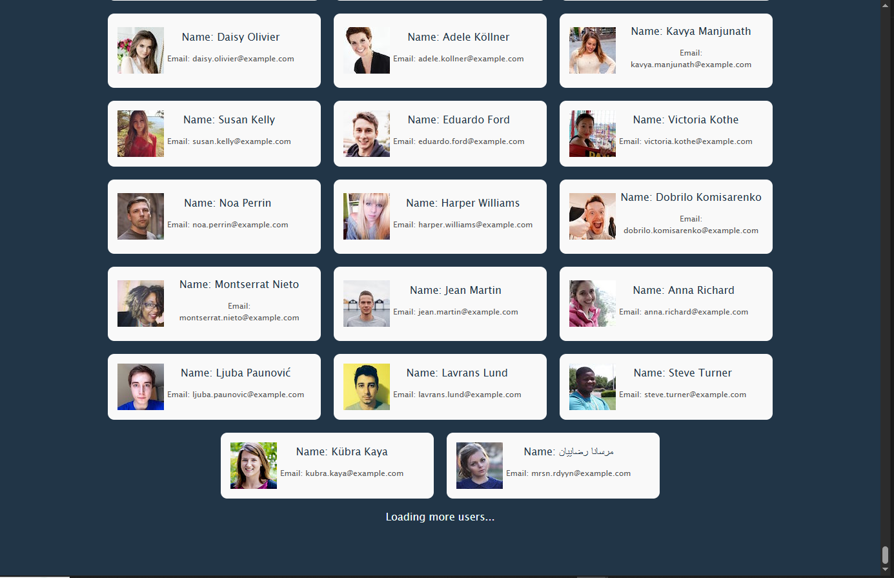

   

## 📸 Screenshots

### Skeleton Loader

### Infinite Scroll

# Users-App-with-Intersection-Observer
Application developed in React.js that consumes the randomuser.me public API to display a list of users with Infinite Scroll, Skeleton Loader, and Empty State, focused on good architecture, UX, and separation of responsibilities. This project is part of my preparation as a React web developer

## 🚀 Features
- 📢 Fetches users and their images from external APIs
- 🦴 Skeleton Loader for initial loading
- 📭 Empty State when no data is available
- ⚠️ Network error handling
- 🧱 Clear separation between UI, logic, and services
- 🔄 Infinite scroll using Intersection Observer

-----

## 🛠️ Tech Stack
- React
- Vite
- CSS
- JavaScript (ES6+)
- Intersection Observer API

## 🧩 Project Structure

src/
├─ components/
│ ├─ UserSkeleton.jsx
│ ├─ EmptyState.jsx
│
├─ hooks/
│ ├─ hookUserApp.jsx
│
├─ services/
│ ├─ ApiUsersApp.js
│
├─ UsersApp.jsx
└─ main.jsx

📌 Architectural decisions

▫ The business logic (fetch, pagination, loading, errors) lives in a custom hook.

▫ UI components are presentational and reusable.

▫ API access is isolated to the services layer.

🪝 Custom Hook: hookUserApp

Responsible for:

▫ Consume the external API

▫ Manage states (users, loading, error)

▫ Implement Infinite Scroll

▫ Expose derived states like isEmpty

*Derived States*
isEmpty: !loading && users.length === 0

This avoids duplicate states and possible inconsistencies.

🦴 Skeleton Loader

It is displayed only during initial loading, improving perceived speed and avoiding sudden changes to the interface.
On subsequent loads (Infinite Scroll), a lightweight loader is used to maintain visual continuity.

📭 Empty State

Renders automatically when:

▫ Loading has finished

▫ The API returns an empty array
To provide clear feedback to the user without blaming them or leaving the screen empty.

🌐 API used

▫ Endpoint: https://randomuser.me/api

▫ Parameters:
  - results: number of users
  - page: pagination

Example: https://randomuser.me/api?results=50&page=1

▶️ Installation and execution

# Clone the repository
git clone <https://github.com/DelPieroj10/Users-App-with-Intersection-Observer.git>

# Install dependencies
npm install

# Run in development
npm run dev

🧪 Possible future improvements

- Tests with Vitest + Testing Library
- Canceling requests with AbortController
- Flag hasMore to stop the observer
- Memorization for large lists

👤 Author

Developed by Jean Piero Parra
- Aspiring React Developer (Trainee / Junior)
- Focus on UX, good practices, and maintainable code

